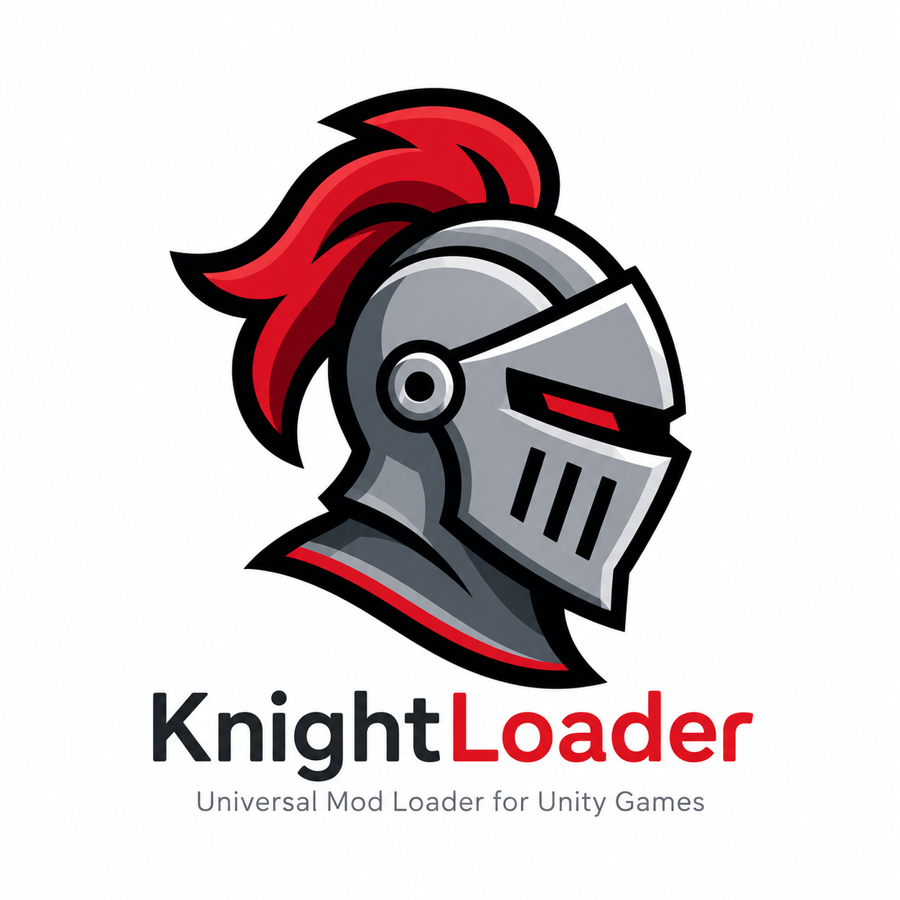

# KnightLoader

**Universal mod loader for Unity (Mono) games — tiny, open, non-invasive.**
First supported game: **Raft**.

- 🌐 **Website & docs:** https://theundeadknightdev.github.io/KnightLoader/
- ⬇️ **Download:** [latest release](https://github.com/TheUndeadKnightDev/KnightLoader/releases/latest)
- 📦 **All versions:** [releases](https://github.com/TheUndeadKnightDev/KnightLoader/releases)

## Install
1. Download the latest `KnightLoader-vX.Y.Z.zip`.
2. Copy everything in it into your game's folder (next to the game's `.exe`).
3. Launch the game — `KnightLoader\KnightLoader.log` confirms it's running.
4. Drop mod DLLs into the `Mods` folder.

**Uninstall:** delete `winhttp.dll`, `doorstop_config.ini`, `.doorstop_version`,
`KnightLoader\` and `Mods\`. No game files are ever modified.

---
This repository hosts the website and release downloads.
© 2026 Undead Knight Developments
